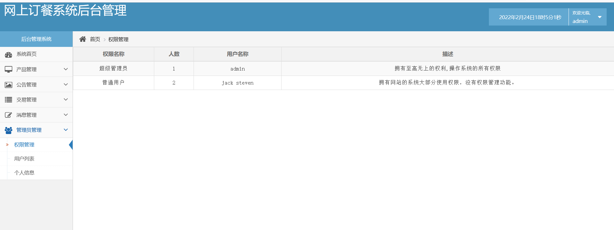

# 计算机毕业设计之Spark+Flink餐饮大数据 外卖大数据 订餐推荐系统 外卖推荐系统 美食推荐系统 外卖数据分析 大数据毕业设计(大屏+支付+推荐算法)

## 要求
### 源码有偿！一套(论文 PPT 源码+sql脚本)

https://www.bilibili.com/video/BV1Uq4y1x7aq?spm_id_from=333.999.0.0

### 
### 加好友前帮忙start一下，并备注github有偿获取源码
### 我的QQ号是2877135669 或者 1679232425
### 加qq好友说明（被部分 网友整得心力交瘁）：
    1.加好友务必按照格式备注
    2.避免浪费各自的时间！
    3.当“客服”不容易，repo 主是体面人，不爆粗，性格好，文明人。

## 开发技术
Hadoop、Spark、SparkSQL、Flink、MySQL、协同过滤算法、echarts、

支付宝沙箱支付

 

 

# 系统创新点

大屏统计可视化(Spark+Flink)

机器学习协同过滤推荐算法

支付宝沙箱支付

# 运行截图

# 运行视频(B站)

https://www.bilibili.com/video/BV1Uq4y1x7aq?spm_id_from=333.999.0.0

